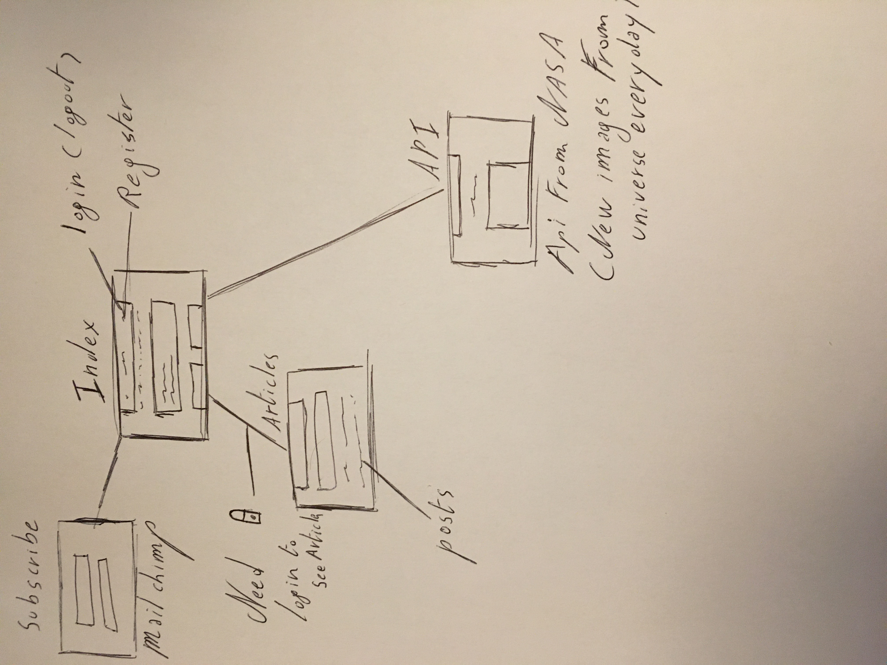
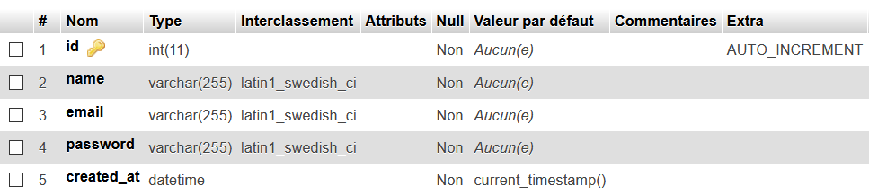
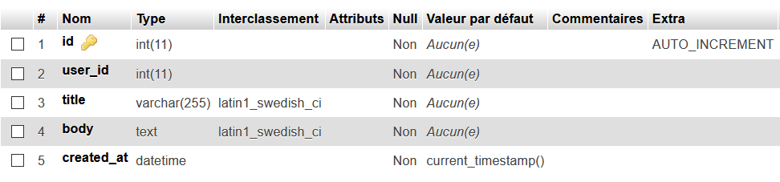
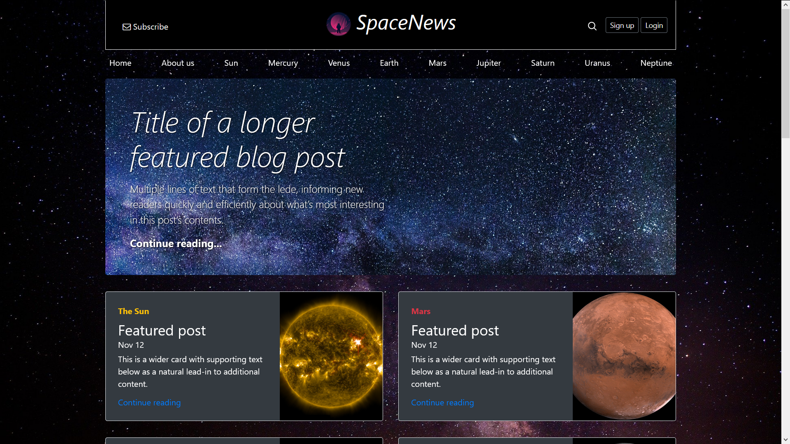

# npProject

- BeCode
- Repository: `OOP`
- Type de challenge:  `Consolidation`
- Durée: `4 semaines`
- Deadline: `16/11/20 9 A.M.`
- Déploiement :
	- Github page
	- Heroku
	- Heroku + remote DBA
	- self-hosting
	- ...
- Team challenge :  `solo`

# Objectif

Réaliser un projet complet (Front end / Back end) sur un thème imposé, j'ai choisis le thème "actualités" que j'ai orienté sur le sujet de "l'univers" et de le faire en PHP orienté objet.

# Schema

# Languages utilisés

- html
- css
- php
- mysql

# Framework utilisé

- bootstrap 4

# Api

En adéquation avec mon thème j'ai choisis une API de la NASA. Elle consiste à montrer une image de l'univers différentes chaque et d'avoir une courte description de celle-ci.

- Le lien de l'API : https://apod.nasa.gov/apod/astropix.html

# Schema de la base de données

- La table pour crée les utilisateurs

- la table pour crée des commentaires

# Screenshot du site

- Header du site

- Partie Posts et footer

